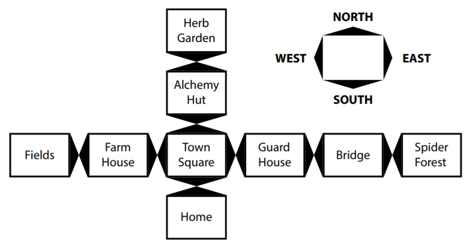
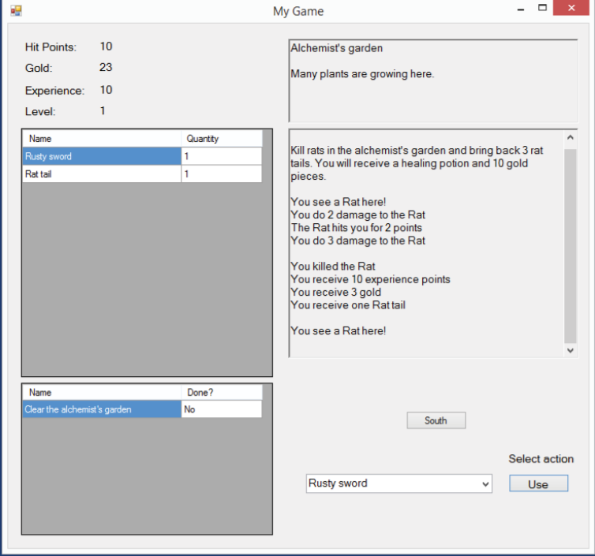

# SuperAdventure
SuperAdventure is an apliccation based on a tutorial about building a very simple role-playing game (RPG) using  C# programming basics.
The game will let you create a player, set up locations for them to travel to, discover quests
to complete, and fight monsters.

# How to run the app

1. Either fork or download the app 
2. Open the folder Release placed in SuperAdventure\bin\Release
3. Double click on the Application file named "SuperAdventure"

# How to play

The controls are simple you just click on what direction you want your hero to go.
The following options are North, East, West, South. If there is a way to continue walking in a direction you desire there will be a button displayed for it.

# Features

- In the top left you can track your hit points, gold, expirience and level.
- Down bellow is your inventory. There you can track the items you have in your bag and their quantity.
- On the bottom left is your quest tracker that tells you either you've completed a quest or not.
- In the top right corner you can see the current location your hero is in followed by a small description of the place.
- In the middle right is positioned the action window. There you can the quest that you recieved and what you has to be done to complete it. 
  Also all the monster encounters happen there plus the rewards you gain after killing one or compleating a quest.
- In the bottom right you can chose from items in your bag to use (if they are usable) and for an example attack a monster with your sword or use a potion (if you have one) to gain back some of your hit points back.

# What the app looks like

